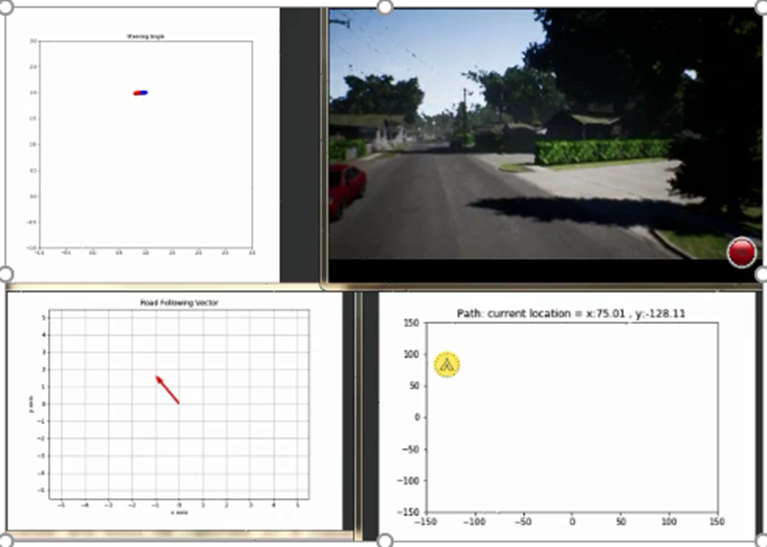
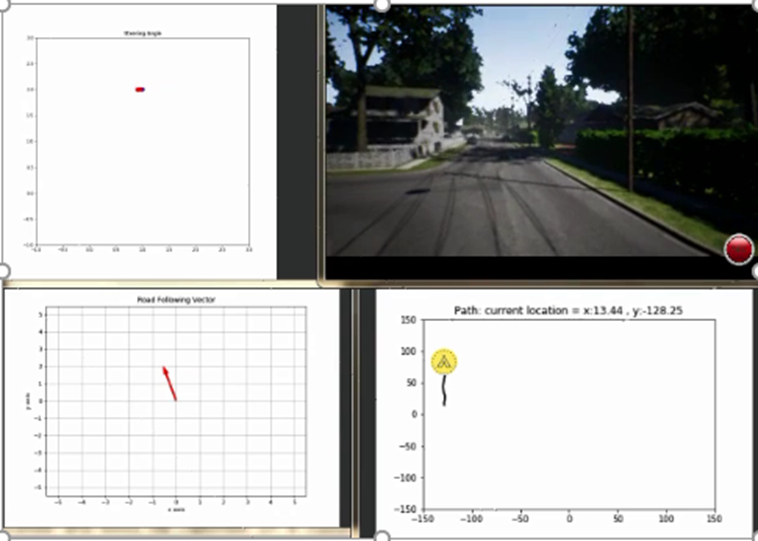
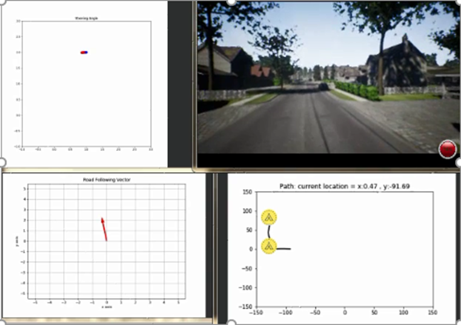
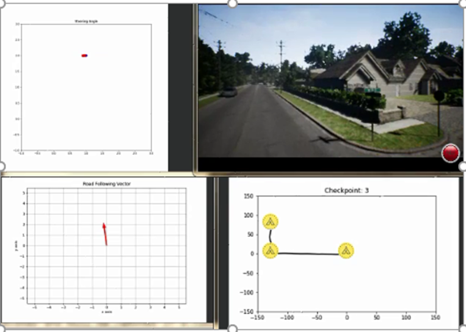
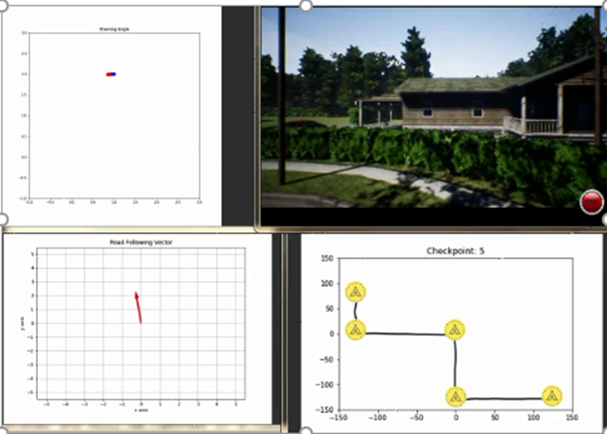

# Introduction to fulfilled projects

Here I give a background to a set of performed project and the softwares or hardware which are used.

## Detection and tracking the targets using deep learning

2017-18

In this project the goal was to detect and track the peoples in a room using computer vision. The camera was corntroled using a servo motor and the targets were detected using deep learning methods such as YOLO and Faster RCNN. The deep learning models were developed using python language through tensorflow and keras libraries. The hardware for processing was Raspberry pie. We gathered and labelled the data using LabelMe. 

## Real Time Semantic Segmentation and autonomous driving

2018-19

In this project, the goal was a visual control of a robot for obstacle avoidance and reach the goal. For testing we used AirSim simulator and trained deep learning models which are good in real time tests such as ENet, BiSeNet, and SegNet. The used library was Tensorflow. Using the output of the model we estimated the location on the road and using a fuzzy controller we made the robot to stay  on the road. We created a map of the area in AirSim and used bellman ford algorithm for path planning and used deep learning output to maintain on road. we also used depth map calculated using a combination of the outputs of the block-based stereo matching methods and also using MonoDepth method which estimates depth using a single approach. 

We tested 2 scenarios. In the first one the start point and goal was from D to K in the graph below:

We tested this scenario in AirSim and you can see some snapshots from this scenario

 

 

