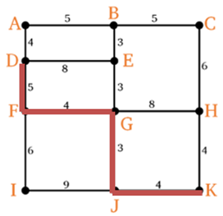
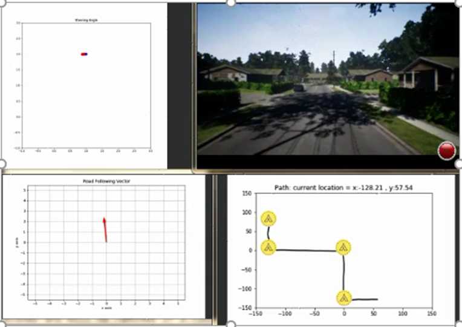

# Introduction to fulfilled projects

Here you will find information about a number of completed projects and the software or hardware used.

## Detection and tracking of targets with Deep Learning

2017-18

This project was about detecting and tracking people in a room using computer vision. The camera was rotated using a servo motor and targets were detected using deep learning methods such as YOLO and Faster RCNN. The deep learning models were developed using the Python language via the Tensorflow and Keras libraries. The hardware for processing was a Raspberry Pie. We collected and labelled the data using LabelMe.

## Semantic Real-Time Segmentation and Autonomous Driving

2018-19

In this project, the goal was to visually control a robot to avoid obstacles and reach the goal. For testing, we used the AirSim simulator and trained deep learning models that are proven in real-time testing, such as ENet, BiSeNet, and SegNet. The library used was Tensorflow. Using the output of the model, we estimated the position on the road and made the robot stay on the road using a fuzzy controller. We created a map of the area in AirSim and used the Bellman-Ford algorithm for path planning and used the Deep Learning results to stay on the road. We also used a depth map computed by combining the results of the block-based stereo matching methods and the MonoDepth method, which estimates depth using a single approach.

We tested 2 scenarios. In the first, the starting point and destination was from D to K in the graph below:

We have tested this scenario in AirSim and you can see an snapshot from this scenario. In the pictures you can see the image observed by the robot and the path followed by the robot and its control commands.

 

These scenarios were also tested on the Jetson TX2.

## Prediction of stock, crypto and FX markets with LSTM approach
2020-21

In this project, the important factors for each market are studied. Then their time series are collected by crawling, different APIs and different resources by data cleaning. Then pre-processing is done to make the data useful for prediction. Then a model based on LSTM is trained and its parameters are optimized to be useful for trading. Its accuracy is evaluated using various metrics such as precision, MAE, MSE, etc. The model is found to be useful in testing and can be far more profitable than the baselines.

## Video object detection for bird detection
2021-22

This project tests different approaches to object detection on a dataset created to detect birds. Some of the approaches tested were image-based, such as Faster RCNN, YOLO, Retinanet, and Swin Transformer, and some others were video-based, such as TransVOD, LSFA, DEFT, Centertrack, SELSA. A post-processing method, REPP, is also tested. Its performance is improved using camera movement compensation. The detection accuracy was 95.07 and with these video methods, the accuracy was improved by 3 percent. The models were tested on the Jetson Xavier board. To obtain a fast model, we also used knowledge distillation and obtained a model with a smaller number of parameters and still good accuracy by training with a large model.

